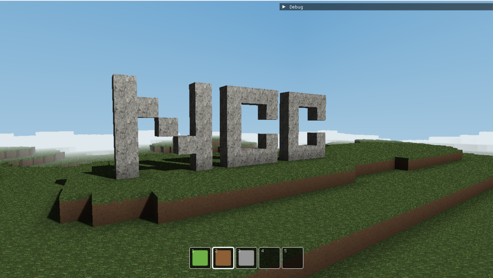
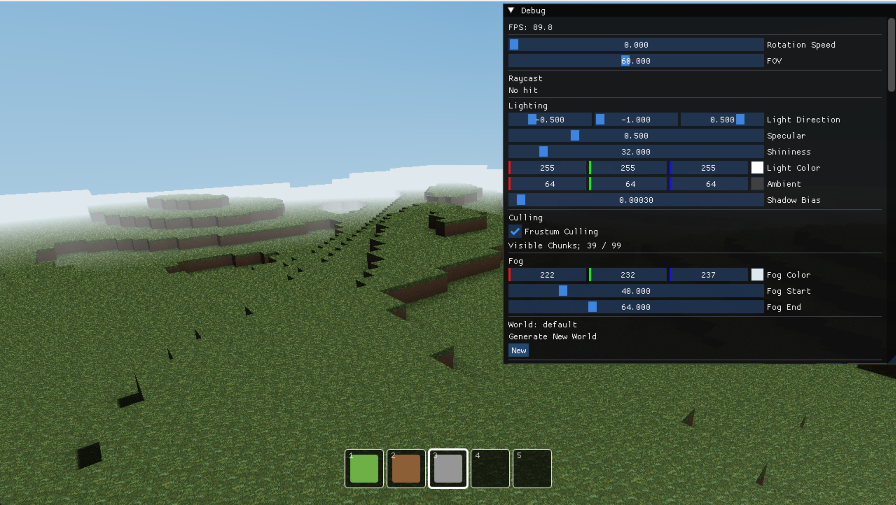

# DirectX12_VoxelWorld

DirectX12とC++17で自作したボクセル描画エンジンです。
無限に広がる地形のチャンクストリーミング、シャドウマップ、
頂点アンビエントオクルージョン、ブロック編集(設置/破壊)とワールドセーブを実装しました。

## 操作

移動：WASD

ジャンプ：SPACE

視点操作：マウス

ブロック破壊：左クリック

ブロック設置：右クリック

ホットバー切り替え：数字キー(1～5)

マウスカーソル表示/非表示：ESC

## 技術スタック

言語：C++17
グラフィックスAPI：DirectX12
シェーダー：HLSL
ビルド：VisualStudio2022, WindowsSDK
外部ライブラリ：Dear ImGui, stb_image, stb_perlin, tiny_obj_loader
		(UI、画像読み込み、ノイズ、OBJ読み込みに使用。エンジン本体は自作)

## 技術ハイライト

### 描画
- ダブルバッファでフレームを並列化。
　フレームごとにCommandAllocator・定数バッファを分け、CPUとGPUを並列に進める設計。
- シャドウマップ：R32_TYPELESS, DSV=D32_FLOAT / SRV=R32_FLOAT。
　3x3 PCFとテクセルスナップで影のちらつきを抑制。
- 6平面フラスタムカリングで視点内にあるチャンクのみ表示。

### ブロック
- 面カリング：隣接しているブロックがある場合、その面は頂点に出力しない。
- 周囲の３ブロックを確認し、頂点アンビエントオクルージョンで陰影を表現。
- パーリンノイズによる地形生成、シード値でワールドの再現可能。

### チャンクストリーミング
- プレイヤーの位置を中心に「メッシング R / データ確保 R+1 / アンロード R+2」で管理。
- メッシュアップロードを通常フレームのCommandListに相乗りさせ、
　中間バッファはFence値に紐づけて遅延解放。
- メッシュスロットをfree-listで再利用 → 新しいチャンクを読み込み続けてもメモリが伸びない。

### ブロック編集とセーブ
- 設置、破壊時のチャンクの更新も通常フレームのCommandListに相乗りで処理。
- 編集差分(world座標→BlockType)を保持し、チャンクをアンロードしても再ロード時に復元
- ワールドの保存は「シード値、編集差分、プレイヤーの位置」をシリアライズ。
　複数ワールドの保存/読み込み/削除に対応。

## 開発について

設計の相談、デバッグ支援、DirectX12の学習補助にClaudeを活用しました。
生成されたコードは内容をしっかりと理解した上で取り込み、
エンジン全体の構造は自身の判断で組み立てています。

## ビルド

1. Visual Studio 2022 で .sln を開く
2. 構成を Release / x64 に設定
3. F5 でビルド・実行

### 動作環境

Windows 10/11
DirectX12 対応GPU
Windows SDK 10.0.x

## ディレクトリ構成

App/        ゲームロジック（Player, Scene, World, Chunk）
Engine/     エンジン層
|- Core/      （Window, FPSCamera）
|- Graphics/  （GfxDevice, Renderer, PSO, Skybox など）
|-  Math/      （Frustum）
|- Resources/ （Mesh, Texture, ModelLoader など）
Shaders/    HLSL シェーダー
ThirdParty/ 外部ライブラリ

## 今後実装していきたいこと

### 技術面
- ワーカースレッドによる並列メッシング
- グリーディメッシング(同方向・同テクスチャの面マージ)
- カスケードシャドウマップ
- 距離フォグの高度化（高さ別の色変化など）

### 機能面
- バイオーム、地形の多様化
- 建造物
- NPC
- サバイバル要素(HP、空腹度など)
- RPG要素(スキル、レベル)
- BGM、SE
